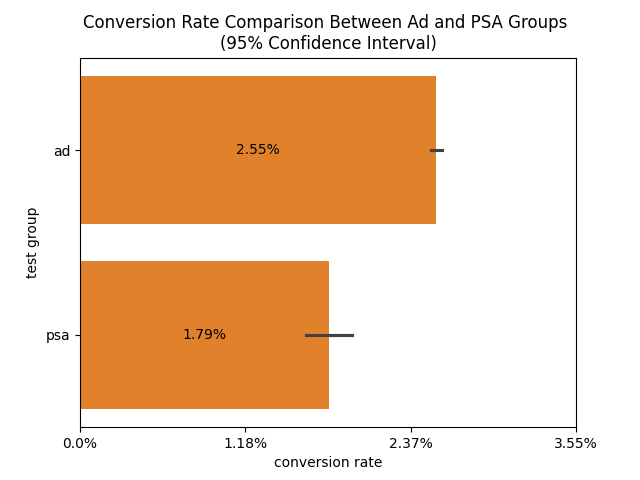
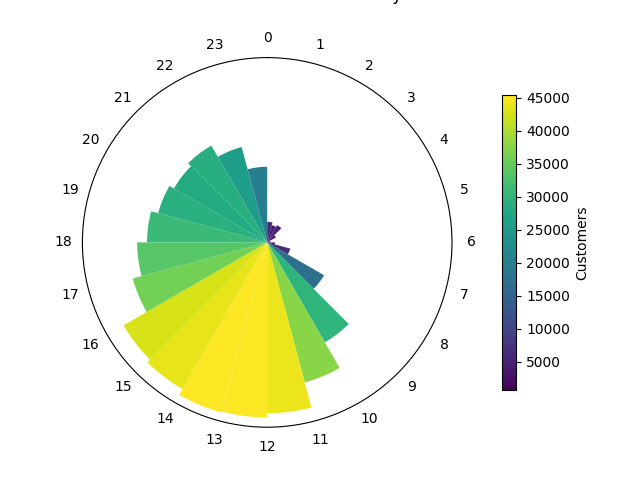
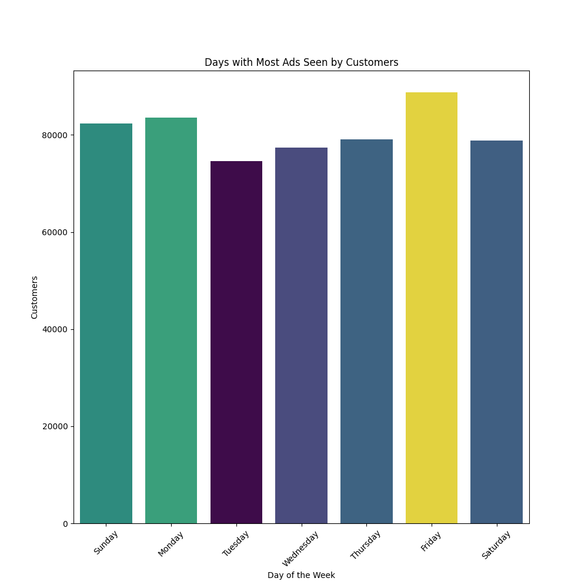
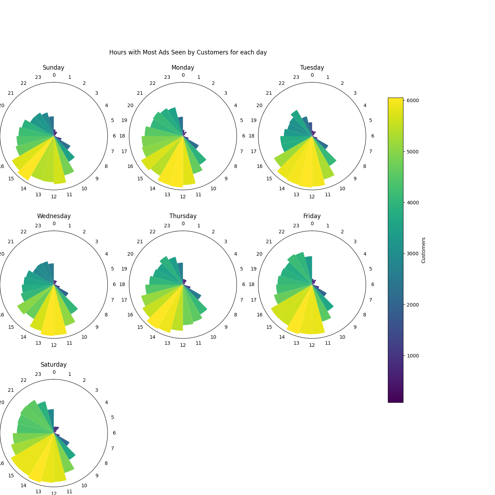

# Marketing-A-B-Test
In this project, with the "Marketing A/B testing dataset" by FavioVázquez, I demonstrate the use of A/B Testing analysis alongside data visualizations to derive insights and recommend actions for the company to make the most of the information gathered.

The notebook contains markdowns that provide full context along with goals and other sections that provide information to its readers before diving into the code and analysis. After visualizations and code blocks, there are markdowns that explain these specific functions in tandem with interpretations for the result. Additionally, the notebook contains all exploratory code that were used to narrow down patterns and create interpretable visualizations for the company. Below is the finalized verdict and the full context of the notebook, excluding all the exploratory code and markdown.

# Context
We will simulate being in a company that has recently implented a Advertisement type of marketing strategy to engage more people in the company's products and services. However, using ads for the company's products and services can cost us more compared to psa, that's why our company has been wondering whether or not this type of implementation is effective or not in converting customers compared to our old strategy of exposing people to Public Service Announcements (PSAs). To inspect this, the company has decided to run an experimental test where a certain number of people are exposed to psa, while the other is exposed to ads. To ensure consistency in the study, the company has made sure that the placement of ads and psa is identical, eliminating the positioning factor in determining whether ads is more effective than psa. 

# Goal
Our job as a Data Scientist is to analyze whether or not this ad implementation is better than our original strategy of using public service announcements. We must be able to evaluate the effectiveness of ads relative to psa, which is our baseline. We must also be able to determine the magnitude by which it is more, or less, effective and then, based on our conclusion, recommend actions that the company should take to optimize revenue.

# Method
To achieve our goal, we will conduct A/B Testing, using Ads as our experimental or treatment group, while psa is our control or baseline group. First, we will process the data to fit the input for our analysis, then, determine whether one or the other is more effective, particularly in converting customers. Afterwards, we then determine whether this finding is significant and, if so then, by how much. We may also draw factors that may affect these analysis, such as the number of people engaged with each type of marketing.

# Data
For this simulation, we will utilize a dataset from Kaggle titled "[Marketing A/B testing](https://www.kaggle.com/datasets/faviovaz/marketing-ab-testing)" dataset by FavioVázquez. This dataset contains data regarding user conversion depending on test group. The columns are detailed as follows:

- user id: User ID (unique)
- test group: If "ad" the person saw the advertisement, if "psa" they only saw the public service announcement
- converted: If a person bought the product then True, else is False
- total ads: Amount of ads seen by person
- most ads day: Day that the person saw the biggest amount of ads
- most ads hour: Hour of day that the person saw the biggest amount of ads

# Results
The test shows that AD performs 43.13% better compared to PSA; however, in reality, AD really only increases the chances of converting by 0.7% more than PSA. This implies that our initial conversion from PSA is really low, which if it is made a baseline then drastically exaggerates AD's performance. Nevertheless, it is still arguably better than PSA, even if only by a little bit. We can look at this more closely by inspecting the conversion rate plot.

In the plot, AD has a conversion rate of 2.55% while PSA has 1.79%. The difference is only about 0.76%. This displays that although AD does perform better, the overall performance of both are still generally considered to be quite low, and so, the chances of converting, on a larger scale, would seem to be rather unchanged. However, we can still improve upon this by looking further into the data we've been presented with.

Now that we know that AD performs better than PSA, we can look to optimize the placement of our AD. Starting with time, we can look at the time frames or hours that our customers are exposed to ads the most.

The plot highlights the hours, in military time, that are reported to have the most ads seen by the customers, denoted by the bright yellow gradient. The gradient moves from yellow to green to blue, denoting the ranges of customer exposure by hour. The range that seems to have the highest customer exposure looks to be the hours 10:00 to 16:00, which, in standard time, is 10:00 AM to 4:00 PM. This information is helpful in narrowing down an optimal time frame for the company to consider when planning the placement of our ad.

We can also narrow down the days of the week that have the most customer exposure, giving us more options to fully optimize the placement of our ad not only by time, but by day of the week, particularly since not all of our customers is likely to have free time during those hours on week days due to busy hours and work schedules. For this, we look at the Ad Exposure Barplot denoting the customer exposure per day of the week.

Much like the Ad Exposure per Hour Plot, the color changes according to the number of customer exposure, moving from yellow (highest) to green (mid), then finally to blue (lowest). Consulting the plot, the top 3 days of the week with the most customer exposure to ads, in order of highest to lowest, is Friday, Monday, and Sunday. This implies that majority of our customers are likely to be quite busy during the middle of the workweek: Tuesday to Thursday. Interestingly, Saturday, albeit being a weekend, is surprisingly quite low, which may indiciate that our customers are likely using Saturday as their rest day or their reserved day of the week where they plan their outings or other hobbies that they personally enjoy.

Using this information, it would be quite beneficial for the company to work with these hours, as a large majority of the customers would likely be able to be exposed to our ad if we were to implement it within these days during the hours 10:00 AM to 4:00 PM. Implementing our ad only on select week days could also plausibly minimize costs as compared to implementing our ad over all days of the week. However, the company could likely want a more descriptive hour per day visual to see other possible options, particularly when there are no open spots available for those specific days at those specific hours. For this, we'll combine both plots into one by making a combined plot that displays the ad exposure per hour for each day of the week.

WIth this plot, we can see the hours with the highest ad exposure for each day of the week. You may immediately notice that not all day of the week follow that 10:00 AM to 4:00 PM time frame that we once defined as the most optimal, which makes this plot significantly important in proper ad planning. Our optimal days of the week: Friday, Monday, and Sunday, seem to all have various ranges, with Monday having the highest bright yellow gradient ranging from 12:00 PM to 2:00 PM. Friday seems to be quite the interesting time plot as it has a low yellow gradient starting from 11:00 AM to 1:00 PM, which then transitions to high yellow gradient at around 1:00 PM to 2:00 PM. Sunday has the least among the three, only having a yellow gradient around 2:00 PM to 3:00 PM, with the rest of the 10:00 AM to 4:00 PM being green.

Wednesday and Thursday share a similar pattern to Sunday wherein they both peak at a defined time frame. Wednesday peaks during 11:00 AM to 1:00 PM while Thursday is during 1:00 PM to 3:00 PM. In contrast, Tuesday and Saturday both have quite a large yellow gradient compared to the rest of the days of the week. Tuesday has a time frame of 11:00 AM to 3:00 PM while Saturday is 11:00 AM to 4:00 PM, peaking particularly at the hours 1:00 PM to 2:00 PM. These two may prove to be a good alternative to ad placement if any of the optimal days of the week are not available, catering specifically to the busy customers that have the least amount of ad exposure.

# Conclusion
Utilizing all the analysis we've done using the dataset, we found that the effects of using ad contrary to psa as a way to market the company's product is undoutedbly significant with a relative lift, with psa as a baseline, of 43.13%; however, ad's absolute lift from psa is only about 0.77% absolute lift implying that although it is significantly better than psa, the conversion rate increases only by a small amount in absolute units. Simply put, even though ad is 43.13% better than psa, ad only increases chances of converting users by about 0.77% more than psa.

In addition to this, we've found that the optimal margin for all days of the week is from 10:00 to 16:00 which is about 10:00 am to 4:00 pm; however, each day of the week does carry varying time ranges of ad exposure, as such, it would be great to narrow down which days to implement the ad to maximize exposure while minimizing cost. The optimal days where majority of the customers are exposed to ads seem to be around weekends, namely Fridays, Sundays, and Mondays.

Consulting the mixed time plot per day of the week, we can see that the optimal time ranges for Sunday, Monday, and Friday seem to be 2:00 PM to 3:00 PM, 12:00 PM to 2:00 PM, and 11:00 AM to 2:00 PM respectively. However, finding a spot for our ad within these exact time ranges may be difficult for the company as these time ranges are around afternoon, which is also where majority of the companies aim to get a spot on, particularly on weekends.

As such, if the company cannot find a suitable spot for these days, we can recommend to opt for the weekdays where majority of the people are busy and the likeliness of an open spot on a weekday is higher than those of weekends. Tuesday seems to be a very nice candidate as it not only has the largest time range ad exposure to our customers but it is also in the middle of the workweek where most of the companies would likely ignore due to many works being quite busy these times. The time range for Tuesday is 11:00 AM to 3:00 PM, which is still around afternoon but is significantly larger compared to the tight time ranges of the other days.

For a final verdict, it is highly recommended that the company implement the ad marketing over psa marketing. The time and day for ads should ideally be around 11:00 AM to 2:00 PM on Fridays, 12:00 PM to 2:00 PM on Mondays, and 2:00 PM to 3:00 PM on Sundays as the top 3 most ad exposure to customers. In the event that the company struggles to find a spot for the ad within these days, the company can opt to find a spot on Tuesday around 11:00 AM to 3:00 PM.